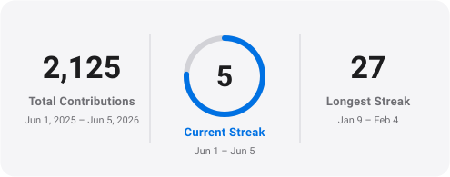
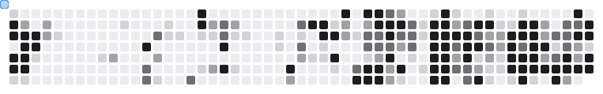

<!-- ───────────────────────────  HERO  ─────────────────────────── -->

 

**SENIOR FULL-STACK ENGINEER**

# Alex Cloudstar

<picture>
  <source media="(prefers-color-scheme: dark)" srcset="https://readme-typing-svg.demolab.com?font=Manrope&weight=600&size=21&pause=1200&color=2997FF&center=true&vCenter=true&width=620&height=40&lines=Architecture%2C+frontend%2C+backend%2C+cloud.;End+to+end.+No+hand-holding.;8%2B+years.+Production+software.;Fintech.+Energy.+Media.+SaaS." />
  
</picture>

Romania &nbsp;·&nbsp; 8+ years shipping production software across fintech, energy, media &amp; SaaS. Self-taught into the field, nine years all in. No hand-holding required.

 

&nbsp;

&nbsp;

 

---

<!-- ─────────────────────  WHAT I WORK WITH  ──────────────────── -->

## What I work with

<table align="center">
<tr>
<td valign="middle" align="right"><strong>Languages</strong></td>
<td>
&nbsp;&nbsp;
&nbsp;&nbsp;
</td>
</tr>
<tr>
<td valign="middle" align="right"><strong>Frontend</strong></td>
<td>
&nbsp;&nbsp;
&nbsp;&nbsp;
&nbsp;&nbsp;
&nbsp;&nbsp;
&nbsp;&nbsp;
&nbsp;&nbsp;
&nbsp;&nbsp;
&nbsp;&nbsp;
&nbsp;&nbsp;
&nbsp;&nbsp;
&nbsp;&nbsp;
&nbsp;&nbsp;
</td>
</tr>
<tr>
<td valign="middle" align="right"><strong>Backend</strong></td>
<td>
&nbsp;&nbsp;
&nbsp;&nbsp;
&nbsp;&nbsp;
</td>
</tr>
<tr>
<td valign="middle" align="right"><strong>Full-Stack</strong></td>
<td>
&nbsp;&nbsp;
&nbsp;&nbsp;
&nbsp;&nbsp;
</td>
</tr>
<tr>
<td valign="middle" align="right"><strong>Databases</strong></td>
<td>
&nbsp;&nbsp;
&nbsp;&nbsp;
&nbsp;&nbsp;
</td>
</tr>
<tr>
<td valign="middle" align="right"><strong>ORMs</strong></td>
<td>
&nbsp;&nbsp;
&nbsp;&nbsp;
&nbsp;&nbsp;
&nbsp;&nbsp;
</td>
</tr>
<tr>
<td valign="middle" align="right"><strong>Cloud &amp; Infra</strong></td>
<td>
&nbsp;&nbsp;
&nbsp;&nbsp;
&nbsp;&nbsp;
</td>
</tr>
<tr>
<td valign="middle" align="right"><strong>Tooling</strong></td>
<td>
&nbsp;&nbsp;
&nbsp;&nbsp;
&nbsp;&nbsp;
&nbsp;&nbsp;
&nbsp;&nbsp;
&nbsp;&nbsp;
&nbsp;&nbsp;
&nbsp;&nbsp;
</td>
</tr>
</table>

---

<!-- ──────────────────────  BY THE NUMBERS  ───────────────────── -->

## By the numbers

<table align="center">
<tr>
<td align="center" width="150"><h2>660+</h2>PULL REQUESTS</td>
<td align="center" width="150"><h2>2.1k</h2>CONTRIBUTIONS / YR</td>
<td align="center" width="150"><h2>18</h2>PUBLIC REPOS</td>
<td align="center" width="150"><h2>39</h2>FOLLOWERS</td>
</tr>
</table>

Snapshot &nbsp;·&nbsp; June 2026 &nbsp;·&nbsp; on GitHub since 2019

  

<picture>
  <source media="(prefers-color-scheme: dark)" srcset="./assets/streak-dark.svg" />
  
</picture>

<picture>
  <source media="(prefers-color-scheme: dark)" srcset="./assets/graph-dark.svg" />
  
</picture>

  

<picture>
  <source media="(prefers-color-scheme: dark)" srcset="./assets/snake-dark.svg" />
  
</picture>

---

<!-- ───────────────────────────  FIND ME  ─────────────────────── -->

## Find me

  

Designed in Romania.

